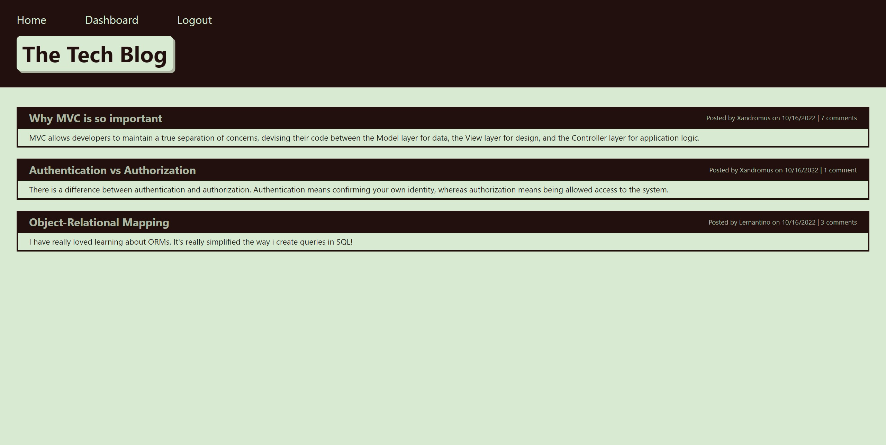

# Module 14 Tech Blog Project

## Description

This is Adrian Jimenez's module 14 Tech Blog challenge submission. 

I initially began this project by organizing the directory using the MVC paradigm, creating folders for models, views, and controllers, and categorizing anything else into its own folder. Afterwards, I began setting up the initial database, and once that was complete I set up the models for said database. Before finishing the models, I used bcrypt to add hooks to the User model to hash the user's passwords and validate their passwords for the future login route. After completing the models, the next step was for me to set up the server itself, which I did using express and various routers. I used sequelize to allow me to use these routes to insert data into the database, and used the express-session-sequelize as well as connect-session-sequelize to log the user's session and manipulate the session data using sequelize. I also made sure to set the session to expire after an hour. After setting up the models and routes, I needed to set up the view which I did using express-handlebars. This allowed me to render html to the user depending on which route they navigated to, and I constructed the pages and styles for these routes using previous knowledge. Once the models, controllers, and views were completed, I added a seeding and schema script to the package, and finalized the project.

## Table of Contents

- [Installation](#installation)
- [Languages](#languages)
- [Usage](#usage)
- [Credits](#credits)
- [License](#license)
- [Contributing](#contributing)
- [Questions](#questions)

## Installation

In order to install this project, download all files and have node.js installed on your machine. Navigate to the directory in which server.js is stored in and type: 

    npm install

Once all dependencies have been downloaded, you can excecute server.js by typing npm start

## Technologies Used

* JavaScript
* Node.JS
* MySQL
* dotenv
* mysql2
* sequelize
* express.js
* express-handlebars
* express-session
* connect-session-sequelize
* HTML
* CSS
* Bootstrap

## Usage

In order to use this project, please create a .env file with the appropriate variables and set up the database using the schema.sql file in the db directory. (Optionally, you can run the command "npm run schema" to run the schema file for you once .env is set up). Once that is set up, simply execute npm start and the application should start.

If you wish to seed the database, run "npm run seed"

Alternatively, visit the site here: https://tech-blog-aj.herokuapp.com

All test account logins use the password "testpassword"

## Credits

* Adrian Jimenez

## License

This project is licensed under the MIT License. See [LICENSE.md](./LICENSE.md) for more details.

---

## Contributing

This project follows the contributor covenant contribution guidelines. See [here](https://www.contributor-covenant.org/version/2/1/code_of_conduct/) 

## Questions

If you have any questions or concerns visit my [github](https://github.com/PuppetAJ) or send me an email at <adrianjimenez1950@gmail.com>. 

